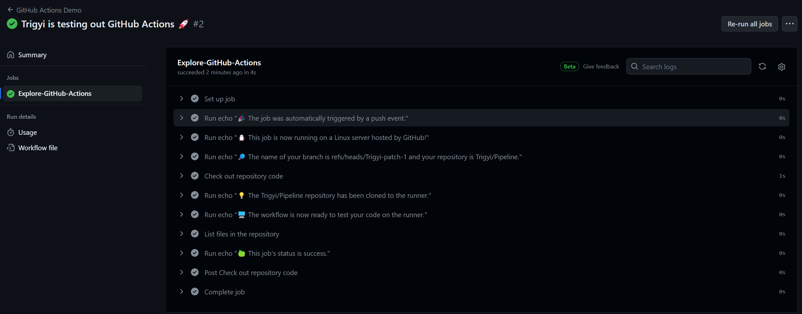

# Mise en place d’une pipeline de CI/CD

## 1. Si vous n’en possédez pas déjà un, créez vous un compte Github et lié votre compte via clé SSH à votre ordinateur

1. Création d'une nouvelle paire de clés SSH :

    ```bash
    PS C:\Users\laura> ssh-keygen -t rsa -b 4096 -C "lauratrombetta81@gmail.com"
    Generating public/private rsa key pair.
    Enter file in which to save the key (C:\Users\laura/.ssh/id_rsa):
    Created directory 'C:\\Users\\laura/.ssh'.
    Enter passphrase (empty for no passphrase):
    Enter same passphrase again:
    Your identification has been saved in C:\Users\laura/.ssh/id_rsa
    Your public key has been saved in C:\Users\laura/.ssh/id_rsa.pub
    The key fingerprint is:
    SHA256:keVXvDbg4KH5VZiFy31pa1/Zia1J67E1LubJ2Brgccc lauratrombetta81@gmail.com
    The key's randomart image is:
    +---[RSA 4096]----+
    |          .  *o  |
    |         +o =.o  |
    |        o+.=.= ..|
    |        o...* =o.|
    |        S+ o E+o=|
    |        . = .o *o|
    |         . ...=oo|
    |            =** o|
    |           o=B.. |
    +----[SHA256]-----+
    ```

2. Ajout de la clé SSH à mon compte GitHub :

    ```bash
    cat ~/.ssh/id_rsa.pub | clip
    ```
    Ensuite dans GitHub on accède à "Settings" > "SSH and GPG keys" > "New SSH key" et on coole notre clé dans l'espace approprié.

3. Test de la connexion SSH

    ```bash
    PS C:\Users\laura> ssh -T git@github.com
    The authenticity of host 'github.com (140.82.121.3)' can't be established.
    ED25519 key fingerprint is SHA256:+DiY3wvvV6TuJJhbpZisF/zLDA0zPMSvHdkr4UvCOqU.
    This key is not known by any other names
    Are you sure you want to continue connecting (yes/no/[fingerprint])? yes
    Warning: Permanently added 'github.com' (ED25519) to the list of known hosts.
    Hi Trigyi! You've successfully authenticated, but GitHub does not provide shell access.
    ```

## 2. Tester un premier workflow Github
1. Créer le répertoire .github/workflows
    ```bash
    laura@Laura_laptop MINGW64 ~/Documents/GitHub/Pipeline (main)
    $ mkdir -p .github/workflows
    ```
2. Créer le fichier yml
    ```bash
    laura@Laura_laptop MINGW64 ~/Documents/GitHub/Pipeline/.github/workflows (main)
    $ touch github-actions-demo.yml
    ```
3. Le commit sur le nouvel branche et le push sont visibles dans le repos GitHub, voici cependant le résultat final du tutoriel avec l'exécution du workflow.
    

    
    


